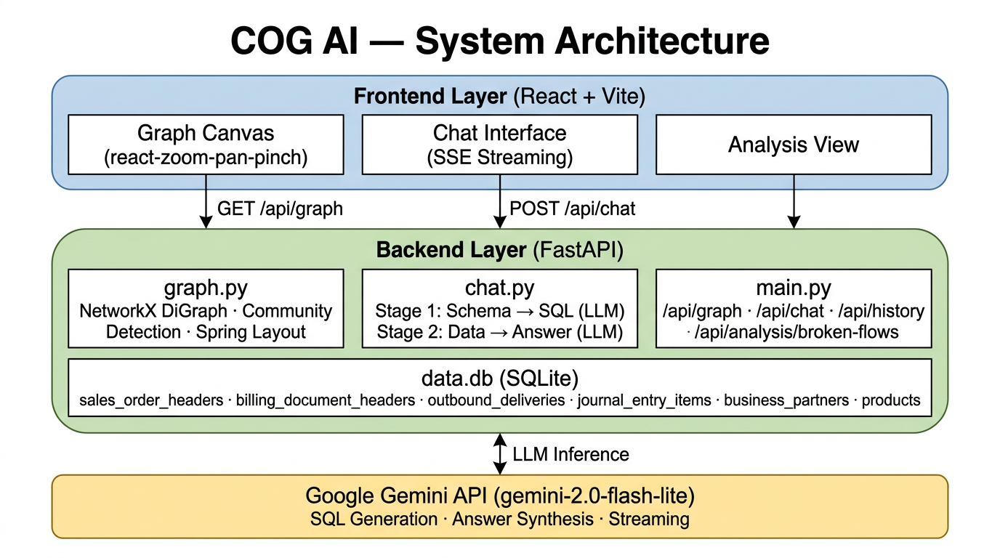

# COG AI — Contextual Graph Intelligence


> **COG AI** is a full-stack, AI-powered context graph system for interactive exploration and natural language analysis of complex **SAP Order-to-Cash (O2C)** business data.

---

## Table of Contents

1. [Overview](#overview)
2. [Why This Architecture?](#why-this-architecture)
3. [System Architecture](#system-architecture)
4. [Feature Reference](#feature-reference)
5. [API Reference](#api-reference)
6. [Data Model](#data-model)
7. [Installation & Setup](#installation--setup)
8. [Project Structure](#project-structure)
9. [Design Decisions & Rationale](#design-decisions--rationale)
10. [Roadmap](#roadmap)

---

## Overview

Traditional business intelligence tools present O2C data as static tables and aggregated dashboards. COG AI takes a fundamentally different approach: it **reconstructs raw SAP document data into a live, interactive relationship graph** and layers a conversational AI reasoning engine on top.

This means you can:
- **See** the full Order → Delivery → Invoice → Payment chain as a navigable graph
- **Ask** natural language questions like *"Which customers have unpaid invoices?"* and get SQL-backed answers
- **Detect** broken flows automatically — stuck orders, unbilled deliveries, uncleared invoices
- **Explore** entity relationships by clicking any node to inspect its full attribute set

---

## Why This Architecture?

### The Problem with Standard BI Dashboards

SAP O2C data is fundamentally **relational and graph-shaped**: a Sales Order links to a Customer, multiple Products, a Delivery, a Billing Document, a Journal Entry, and one or more Payments. Standard dashboards flatten this into rows and pie charts, destroying the relational structure that makes anomaly detection meaningful.

### Why a Graph?

A **directed graph (DiGraph)** is the canonical representation of a flow-based process:
- **Directionality** matters: `ORDER → DELIVERY → INVOICE → PAYMENT` is a one-way pipeline
- **Missing edges** directly indicate process breaks (stuck orders, unbilled deliveries)
- **Cluster analysis** on a graph reveals which customers or products form the densest hubs

Using `networkx.DiGraph` instead of an undirected graph ensures that traversal, edge semantics, and anomaly detection are all logically correct.

### Why SQLite Instead of a Graph Database?

Graph databases (Neo4j, etc.) add operational complexity and require a separate server. Since the O2C dataset is **bounded in size and known in structure**, SQLite is the optimal fabric for three reasons:
1. **Zero-dependency local setup** — no external database server needed
2. **Full SQL expressiveness** — complex multi-table joins for the LLM to reason over
3. **Instant schema injection** — the entire DDL can be serialized and injected into an LLM context window in milliseconds

The graph layer is computed **on top of** the relational data at startup, combining the querying power of SQL with the visual power of a graph.

### Why LLM-Powered Text-to-SQL?

Hardcoded query builders break when schema changes. An LLM that receives the full schema dynamically can:
- Adapt to new columns or tables without code changes
- Handle **ambiguous natural language** and resolve it to precise SQL
- Synthesize raw result sets into human-readable, insight-rich responses

The two-stage pipeline (SQL generation → response synthesis) keeps each LLM call focused and grounded, minimizing hallucination.

---


## System Architecture



---

## Feature Reference

### 1. Interactive Entity Graph

- **Directed graph** with 7 node types, each color-coded: Orders (Amber), Customers (Indigo), Products (Emerald), Deliveries (Purple), Invoices (Rose), Journal Entries (Cyan), Payments (Teal)
- **Physics-based layout** using NetworkX `spring_layout` — entities with many shared relationships cluster naturally together
- **Draggable nodes** with scale-aware pointer tracking. Moving a node at 10% zoom or 400% zoom behaves identically
- **Canvas panning lock** — panning is automatically disabled while dragging a node to prevent workspace drift
- **Real-time edge sync** — SVG edges recalculate position on every pointer move frame
- **Node spacing slider** (0.5x–3.0x) to expand or collapse the graph interactively relative to its geometric center
- **Triple reset system**:
  - `Restart Alt` → restore all nodes to original layout coordinates
  - `Zoom Out Map` → center and fit the entire graph in the viewport

### 2. Node Details Panel

Clicking any node opens a grouped attribute panel with:
- **HEADER** section: IDs, dates, created-by user
- **FINANCIALS** section: amounts, currency, payment terms, incoterms
- **LOGISTICS** section: delivery status, billing status, block reasons
- **ITEMS** section: line items with materials, quantities, plants
- **NETWORK INFO** section: cluster ID from community detection

### 3. Conversational AI with Context Memory

The chat interface uses a **two-stage LLM pipeline**:

**Stage 1 — SQL Generation:**
- The full SQLite schema (all table names + column names) is injected into the prompt
- The last 6 messages of conversation history are also included, enabling follow-up questions like *"What is the total net amount for this order?"* after asking about a specific order
- A domain guardrail rejects off-topic queries (general knowledge, creative writing) before they reach the database

**Stage 2 — Answer Synthesis:**
- The raw SQL result set is passed back to the LLM
- The LLM synthesizes a natural, markdown-formatted, grounded response
- Responses stream in real-time via **Server-Sent Events (SSE)**, creating a smooth typewriter effect

**Node Highlighting:**
- Column names from the query result are parsed heuristically against graph node prefixes
- Matching nodes are automatically highlighted on the graph with a pulsing glow animation

### 4. Process Health / Broken Flow Analysis

A dedicated analysis dashboard at `/analysis` runs three diagnostic queries:

| Gap Type | Detection Logic |
|---|---|
| **Stuck Orders** | Sales orders with no matching outbound delivery document |
| **Unbilled Deliveries** | Delivered goods with no corresponding billing document |
| **Unpaid Invoices** | Billing documents where the linked accounting document has no clearing entry |

These queries use `LEFT JOIN` absence detection — a pattern that is more reliable than status flag checks, which can be stale or misconfigured in SAP systems.

### 5. Session Management

- **New Chat** button saves the current conversation to `backend/history/` as a structured Markdown file containing all messages, SQL queries, and highlighted entities
- **History View** lists all saved sessions; clicking any restores the full conversation with its highlighted graph state
- **Delete** button removes individual sessions from the history list
- **Export** downloads the current chat as a `.md` file locally

### 6. In-Memory Graph Caching

The graph is computationally expensive to build (joins, layout calculation, community detection). It is cached in `_graph_cache` after first load and only rebuilt when `GET /api/graph?refresh=true` is explicitly called. This makes subsequent page loads near-instantaneous.

---

## API Reference

| Method | Endpoint | Description |
|---|---|---|
| `GET` | `/api/graph` | Returns full graph JSON (nodes + edges). Accepts `?refresh=true` to force rebuild |
| `POST` | `/api/chat` | Accepts `{query, history}`. Streams SSE response with text, SQL, results, highlights |
| `GET` | `/api/history` | Lists all saved conversation sessions |
| `GET` | `/api/history/{id}` | Retrieves a specific conversation by ID |
| `POST` | `/api/history` | Saves a conversation. Accepts `{id, messages, totalTokens}` |
| `DELETE` | `/api/history/{id}` | Deletes a conversation session |
| `GET` | `/api/analysis/broken-flows` | Returns stuck orders, unbilled deliveries, and unpaid invoices |

### Chat SSE Stream Format

The `/api/chat` endpoint streams newline-delimited `data:` events:

```
data: {"text": "Order 740523 is..."}     ← streamed text chunks
data: {"text": " a sales order..."}
data: {                                   ← final payload
  "sql": "SELECT ...",
  "results": {"columns": [...], "rows": [...]},
  "highlight_nodes": ["ORDER_740523", "CUST_320000083"],
  "usage": {"total_tokens": 412}
}
```

---

## Data Model

The system ingests SAP JSONL exports. Each subfolder in `sap-o2c-data/` maps to a SQLite table.

```
sap-o2c-data/
├── sales_order_headers/        → sales_order_headers table
├── sales_order_items/          → sales_order_items table
├── outbound_delivery_headers/  → outbound_delivery_headers table
├── outbound_delivery_items/    → outbound_delivery_items table
├── billing_document_headers/   → billing_document_headers table
├── billing_document_items/     → billing_document_items table
├── journal_entry_items_accounts_receivable/ → journal_entry_items_... table
├── business_partners/          → business_partners table
├── products/                   → products table
└── product_descriptions/       → product_descriptions table
```

### Graph Node → Table Mapping

| Node Prefix | Source Table | Key Column |
|---|---|---|
| `ORDER_` | `sales_order_headers` | `salesOrder` |
| `CUST_` | `business_partners` | `businessPartner` |
| `PROD_` | `products` | `product` |
| `DEL_` | `outbound_delivery_headers` | `deliveryDocument` |
| `INV_` | `billing_document_headers` | `billingDocument` |
| `JE_` | `journal_entry_items_accounts_receivable` | `accountingDocument` |
| `PAY_` | `journal_entry_items_accounts_receivable` | (clearing entries) |

---

## Installation & Setup

### Prerequisites

- Python 3.10+
- Node.js 20+
- [Google AI Studio API Key](https://aistudio.google.com/app/apikey)

### 1. Clone & Configure

```bash
git clone <repo-url>
cd cog-ai
```

Create `backend/.env`:
```env
GEMINI_API_KEY=your_api_key_here
```

Create root `.env`:
```env
VITE_API_URL=http://127.0.0.1:8000
```

### 2. Backend Setup

```powershell
# Create and activate virtual environment
python -m venv backend/venv
backend\venv\Scripts\Activate.ps1

# Install dependencies
pip install -r backend/requirements.txt

# Ingest data into SQLite
python backend/database.py

# Start the API server
uvicorn backend.main:app --reload --port 8000
```

### 3. Frontend Setup

```bash
npm install
npm run dev
```

Open [http://localhost:3000](http://localhost:3000).

### 4. Verify

- The graph should load with colored nodes connected by edges
- Typing a question in the chat panel should return a streamed AI response
- The Analysis tab should show broken flow cards

---

## Project Structure

```
cog-ai/
├── backend/
│   ├── __init__.py           # Makes backend a Python package (enables relative imports)
│   ├── main.py               # FastAPI application, all API routes
│   ├── graph.py              # networkx graph builder, layout, clustering
│   ├── chat.py               # Two-stage LLM pipeline (SQL + synthesis), SSE streaming
│   ├── database.py           # JSONL ingestion into SQLite
│   ├── data.db               # SQLite database (generated on first ingest)
│   ├── history/              # Saved markdown conversation files
│   ├── requirements.txt      # Python dependencies
│   └── .env                  # GEMINI_API_KEY (not committed)
├── src/
│   ├── App.tsx               # Main application: graph canvas, chat panel, state management
│   └── components/
│       ├── AnalysisView.tsx  # Broken flow dashboard
│       ├── HistoryView.tsx   # Conversation history browser
│       ├── SettingsView.tsx  # Theme and settings panel
│       └── HelpView.tsx      # Help documentation
├── sap-o2c-data/             # Source JSONL data (one folder per entity type)
├── .env                      # VITE_API_URL (root env for frontend)
├── vite.config.ts            # Vite config with env variable injection
├── package.json
└── README.md
```

---

## Design Decisions & Rationale

### Directed Graph (DiGraph) vs Undirected Graph

**Decision**: Use `networkx.DiGraph`

**Rationale**: The O2C process is a directed pipeline — a Sales Order creates a Delivery, which triggers a Billing Document, which generates a Journal Entry, which is cleared by a Payment. Representing this as an undirected graph would lose the *causality* of the flow. With a DiGraph, absence of an outgoing edge from a Delivery node is a mathematically precise signal for an unbilled delivery — not an inference.

### Two-Stage LLM Pipeline (not one-shot)

**Decision**: Separate SQL generation from answer synthesis into two distinct LLM calls.

**Rationale**: A single prompt asking an LLM to "translate this question to SQL, run it, and give an answer" produces unreliable results because it conflates two very different tasks. By separating them:
1. **Stage 1** produces only SQL — a verifiable artifact we can execute and validate
2. **Stage 2** receives *real database results* — the answer is always grounded

This pattern is more expensive (two API calls) but substantially more reliable and debuggable.

### History Context in SQL Prompt

**Decision**: Inject the last 6 conversation turns into the SQL generation prompt (not just the answer synthesis prompt).

**Rationale**: Follow-up questions like *"Is the order delivered?"* after discussing order 740523 require the SQL generator to understand that "the order" = `salesOrder = 740523`. Without history context in Stage 1, the SQL generator sees only the ambiguous short query and cannot resolve the reference. Injecting history into Stage 1 ensures the SQL is correctly parameterized.

### SQLite over a Dedicated Graph Database

**Decision**: Use SQLite as the primary data store; NetworkX as an in-memory graph layer.

**Rationale**: A graph database like Neo4j would add significant operational overhead (separate server process, Cypher query language, different client library) without meaningful benefit at this data scale. SQLite provides full relational expressiveness, instant startup, and zero external dependencies. The graph layer is derived at runtime from the relational data — combining the best of both worlds.

### Server-Sent Events for Streaming

**Decision**: Use SSE (Server-Sent Events) over WebSockets for the chat stream.

**Rationale**: SSE is a simpler, unidirectional streaming protocol — perfect for the chat use case where the server pushes data to the client. WebSockets add bidirectional complexity that isn't needed here. FastAPI's `StreamingResponse` natively supports SSE with minimal boilerplate.

### In-Memory Graph Cache

**Decision**: Cache the built graph in `_graph_cache` on the FastAPI process.

**Rationale**: Building the graph involves 7+ SQL queries, a NetworkX spring layout computation, and community detection — this takes 1–3 seconds on a cold start. Caching it in memory after first build reduces all subsequent loads to ~0ms. The cache is invalidated via `?refresh=true` when data changes.

### Community Detection for Cluster IDs

**Decision**: Run `greedy_modularity_communities` on the graph and expose cluster IDs in node data.

**Rationale**: In a dense O2C graph with 100+ nodes, it's not immediately obvious which customers or products form activity hubs. Community detection mathematically partitions the graph into groups of highly-connected entities — making it trivial to identify, for example, a cluster of high-volume orders all serviced by the same distribution center.

---

## Roadmap

- [x] Directed graph model (DiGraph)
- [x] Full O2C node coverage (Orders, Customers, Products, Deliveries, Invoices, Journal Entries, Payments)
- [x] Two-stage Text-to-SQL pipeline with domain guardrails
- [x] Real-time SSE streaming with typewriter effect
- [x] Conversation history context in SQL generation (follow-up questions)
- [x] Interactive draggable nodes with scale-aware pointer tracking
- [x] Graph community detection and cluster ID visualization
- [x] Node spacing slider (0.5x–3.0x dynamic layout expansion)
- [x] In-memory graph caching with manual refresh
- [x] Process Health dashboard (broken flow detection)
- [x] Session management (save, load, delete, export conversations)
- [x] Entity highlighting — chat results pulse matching nodes on the graph
- [ ] Multi-user session isolation
- [ ] Time-series view of O2C flow velocity
- [ ] Anomaly scoring — rank broken flows by financial exposure

---

## Acknowledgments

Built on top of the Google Gemini API, FastAPI, NetworkX, and React.  
Developed as part of the Contextual Intelligence research initiative.
